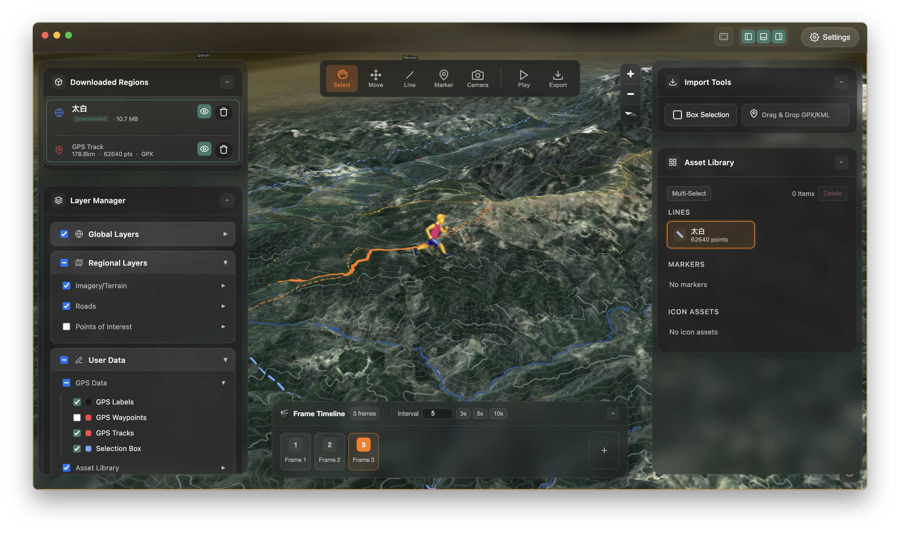

  

<h1 align="center">TrekReel | 途影</h1>

  <strong>Turn Every Outdoor Route Into a Shareable 3D Story</strong> 
  Local-first 3D storytelling for hikers, cyclists, runners, and route planners.

  
  

  
  
  
  

  
  

  <strong>
    <a href="./README.md">English</a> &nbsp;|&nbsp;
    <a href="./readme-locales/pages/README.zh-CN.md">中文 (Simplified Chinese)</a> &nbsp;|&nbsp;
    <a href="./readme-locales/pages/README.es-ES.md">Español</a> &nbsp;|&nbsp;
    <a href="./readme-locales/pages/README.fr-FR.md">Français</a> &nbsp;|&nbsp;
    <a href="./readme-locales/pages/README.de-DE.md">Deutsch</a> &nbsp;|&nbsp;
    <a href="./readme-locales/pages/README.it-IT.md">Italiano</a> &nbsp;|&nbsp;
    <a href="./readme-locales/pages/README.pt-BR.md">Português (Brasil)</a> &nbsp;|&nbsp;
    <a href="./readme-locales/pages/README.ja-JP.md">日本語</a> &nbsp;|&nbsp;
    <a href="./readme-locales/pages/README.ko-KR.md">한국어</a> &nbsp;|&nbsp;
    <a href="./readme-locales/pages/README.ru-RU.md">Русский</a> &nbsp;|&nbsp;
    <a href="./readme-locales/pages/README.ar-SA.md">العربية</a> &nbsp;|&nbsp;
    <a href="./readme-locales/pages/README.hi-IN.md">हिन्दी</a>
  </strong>

---

## About

**TrekReel** is a local-first 3D storytelling app that turns outdoor routes into cinematic map videos, presentation-ready visuals, and terrain-based stories without sending your data to the cloud.

## Editions

- **Mac App Store**: the full commercial edition for macOS, with the broadest export surface.
- **GitHub Community Builds**: public `DMG` and `EXE` downloads with the purchase wall removed and a lighter feature surface.

## Highlights

### 1. Fast Route Visualization

Import `GPX`, `KML`, or `KMZ` tracks and generate a 3D terrain scene quickly for hiking plans, ride recaps, and outdoor storytelling.

### 2. Clear Terrain Context

Add markers and route annotations with terrain context so camps, water points, scenic stops, and hazards are easier to explain.

## Key Features

| Feature | Description |
| --- | --- |
| Import Tracks | Drag and drop `GPX`, `KML`, and `KMZ` files |
| 3D Terrain | Real elevation data with satellite and outdoor map overlays |
| Storytelling Tools | Camera motion, annotations, and presentation-friendly scenes |
| Local Workflow | Route data stays on your device |
| Community Export | Basic image export and `720p` video export |
| Commercial Edition | Mac App Store version keeps the fuller export workflow |

## Resources

- **Website**: [hooosberg.github.io/TrekReel](https://hooosberg.github.io/TrekReel/)
- **Support**: [Support Center](https://hooosberg.github.io/TrekReel/support.html)
- **Privacy**: [Privacy Policy](https://hooosberg.github.io/TrekReel/privacy.html)
- **Terms**: [Terms of Service](https://hooosberg.github.io/TrekReel/terms.html)
- **Sources**: [Data Source Credits](https://hooosberg.github.io/TrekReel/sources.html)

## Contact

- **GitHub**: [hooosberg/TrekReel](https://github.com/hooosberg/TrekReel)
- **Email**: [zikedece@proton.me](mailto:zikedece@proton.me)

## Sibling projects

Built by [hooosberg](https://github.com/hooosberg):

- [AgentLimb](https://agentlimb.com) — teach AI to control your browser
- [BeRaw](https://hooosberg.github.io/BeRaw/) — Behance raw-image grabber
- [Packpour](https://hooosberg.github.io/Packpour/) — App Store Connect locale filler
- [WitNote](https://hooosberg.github.io/WitNote/) — local-first AI writing companion
- [GlotShot](https://hooosberg.github.io/GlotShot/) — perfect App Store preview images
- [DOMPrompter](https://hooosberg.github.io/DOMPrompter/) — visualize DOM for AI code
- [UIXskills](https://uixskills.com) — AI → JSON → Whiteboard → UI

Copyright © 2026 TrekReel. All rights reserved.
