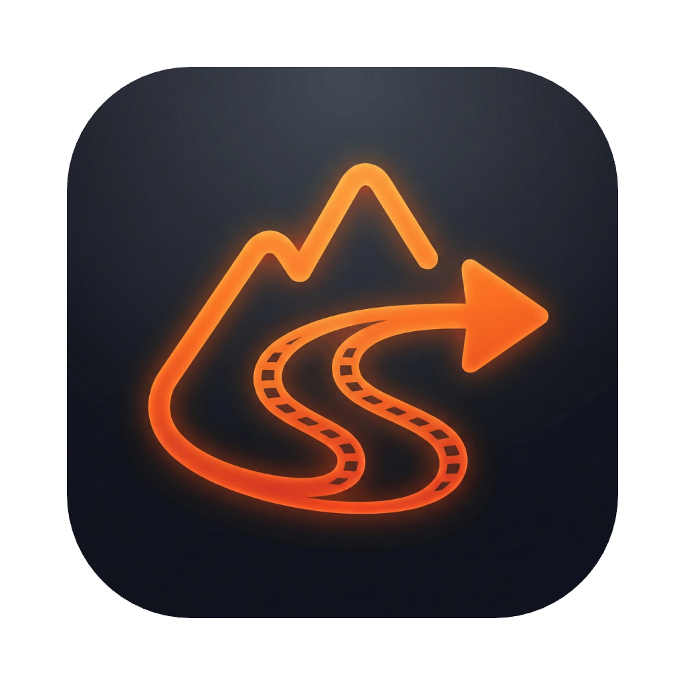
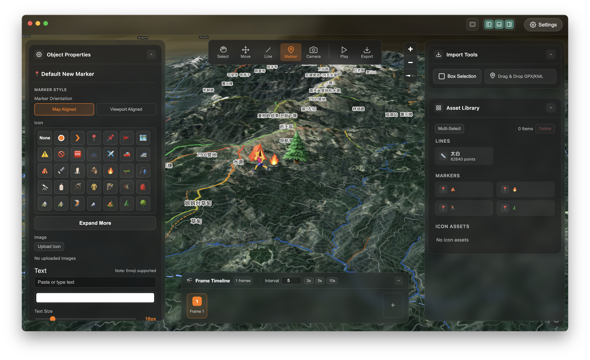
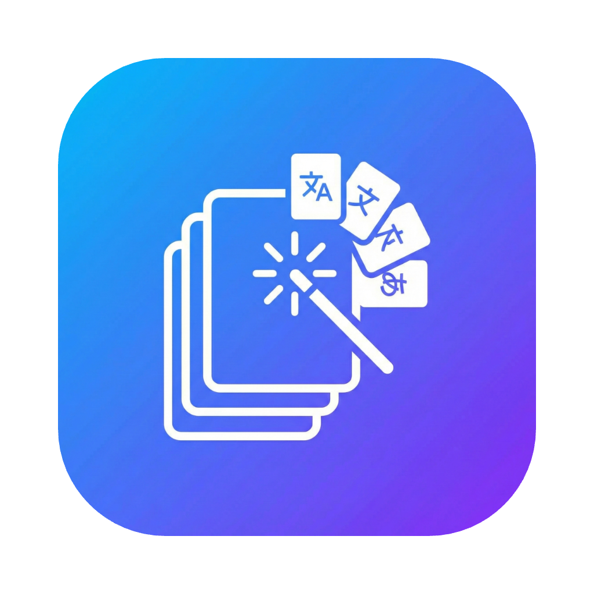

  

<h1 align="center">TrekReel | 途影</h1>

  <strong>Turn Every Outdoor Route Into a Shareable 3D Story</strong> 
  把每一次户外轨迹变成可分享的 3D 故事

  
  
  
  

  
  

  <strong>
    <a href="../../README.md">English</a> &nbsp;|&nbsp;
    <a href="./README.zh-CN.md">中文 (Simplified Chinese)</a> &nbsp;|&nbsp;
    <a href="./README.es-ES.md">Español</a> &nbsp;|&nbsp;
    <a href="./README.fr-FR.md">Français</a> &nbsp;|&nbsp;
    <a href="./README.de-DE.md">Deutsch</a> &nbsp;|&nbsp;
    <a href="./README.it-IT.md">Italiano</a> &nbsp;|&nbsp;
    <a href="./README.pt-BR.md">Português (Brasil)</a> &nbsp;|&nbsp;
    <a href="./README.ja-JP.md">日本語</a> &nbsp;|&nbsp;
    <a href="./README.ko-KR.md">한국어</a> &nbsp;|&nbsp;
    <a href="./README.ru-RU.md">Русский</a> &nbsp;|&nbsp;
    <a href="./README.ar-SA.md">العربية</a> &nbsp;|&nbsp;
    <a href="./README.hi-IN.md">हिन्दी</a>
  </strong>

---

### 关于

**途影 (TrekReel)** 是一款本地优先的 3D 故事制作应用，专为徒步、越野、骑行爱好者设计。导入 GPX 轨迹后，可快速生成电影级路线动画，无需云端，隐私优先。

### ✨ 亮点展示

#### 1. 像地图 PPT 一样简单
无需复杂操作，导入 GPX 自动生成三维地形。支持框选或手绘路线，快速呈现户外规划。

#### 2. 丰富的信息标注
在关键位置添加标记与注释。结合地形起伏，直观展示营地、水源与风险点。

### 🚀 主要功能

| 功能 | 说明 |
| --- | --- |
| 📥 **导入轨迹** | 支持拖拽导入 `GPX`、`KML`、`KMZ` 文件 |
| 🏔️ **3D 地形** | 基于真实高程数据，支持卫星图与户外图叠加 |
| 🎬 **电影级运镜** | 平滑相机插值与关键帧系统 |
| 📍 **丰富标注** | 在关键位置添加标记、照片和注释 |
| 🎥 **视频导出** | 支持多种分辨率导出路线视频 |
| 🔒 **隐私优先** | 数据仅保存在本地，支持离线使用 |

---

### 📖 产品文档

- **[官方网站](https://hooosberg.github.io/TrekReel/)**
- **[使用指南](https://hooosberg.github.io/TrekReel/support.html)**
- **[隐私政策](https://hooosberg.github.io/TrekReel/privacy.html)**
- **[服务条款](https://hooosberg.github.io/TrekReel/terms.html)**
- **[数据源致谢](https://hooosberg.github.io/TrekReel/sources.html)**

### 📬 联系我们

- **GitHub**: [hooosberg/TrekReel](https://github.com/hooosberg/TrekReel)
- **Email**: [zikedece@proton.me](mailto:zikedece@proton.me)

### 🙏 更多项目

<table>
  <tr>
    <td align="center">
      <a href="https://hooosberg.github.io/WitNote/">
         
        <b>WitNote</b>
      </a>
    </td>
    <td align="center">
      <a href="https://hooosberg.github.io/GlotShot/">
         
        <b>GlotShot</b>
      </a>
    </td>
    <td align="center">
      <a href="https://uixskills.com/">
         
        <b>UIX Skills</b>
      </a>
    </td>
  </tr>
</table>

Copyright © 2026 TrekReel. All rights reserved.
