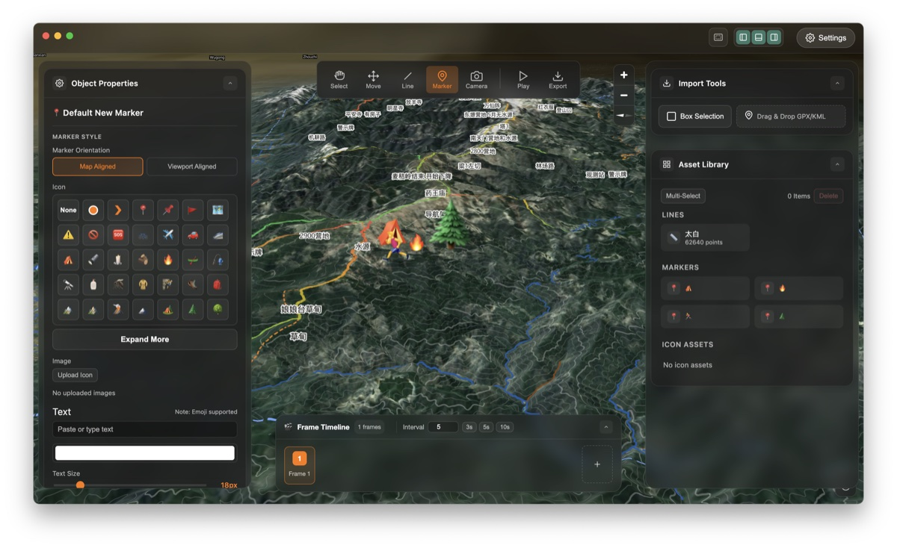
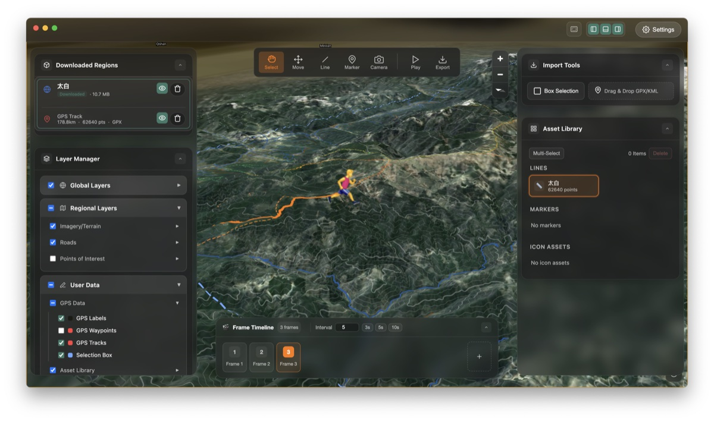

  

<h1 align="center">TrekReel</h1>

  <strong>Vire todas as rotas ao ar livre Em uma história 3D compartilhável</strong> 
  Construído para caminhantes, corredores e ciclistas. Importe GPX e crie vídeos 3D cinematográficos instantaneamente.

  
  
  
  

  
  

  <strong>
    <a href="../../README.md">English</a> &nbsp;|&nbsp;
    <a href="./README.zh-CN.md">中文 (Simplified Chinese)</a> &nbsp;|&nbsp;
    <a href="./README.es-ES.md">Español</a> &nbsp;|&nbsp;
    <a href="./README.fr-FR.md">Français</a> &nbsp;|&nbsp;
    <a href="./README.de-DE.md">Deutsch</a> &nbsp;|&nbsp;
    <a href="./README.it-IT.md">Italiano</a> &nbsp;|&nbsp;
    Português (Brasil) &nbsp;|&nbsp;
    <a href="./README.ja-JP.md">日本語</a> &nbsp;|&nbsp;
    <a href="./README.ko-KR.md">한국어</a> &nbsp;|&nbsp;
    <a href="./README.ru-RU.md">Русский</a> &nbsp;|&nbsp;
    <a href="./README.ar-SA.md">العربية</a> &nbsp;|&nbsp;
    <a href="./README.hi-IN.md">हिन्दी</a>
  </strong>

---

### About

Construído para caminhantes, corredores e ciclistas. Importe GPX e crie vídeos 3D cinematográficos instantaneamente.

### ✨ Highlights

#### 1. Tão simples quanto um mapa PPT
Gere automaticamente terreno 3D a partir do GPX. Desenhe rotas manualmente ou importe para visualizar planos instantaneamente.

#### 2. Anotações ricas
Adicione marcadores em pontos-chave. Visualize acampamentos, fontes de água e riscos com o contexto do terreno.

### 🚀 Features

| | |
| --- | --- |
| 🏔️ **Visualização de terreno 3D** | Os dados reais de elevação encontram-se com imagens de satélite. visualize seu caminho com profundidade. |
| 📍 **Roteiro de Contação de Histórias** | Mais do que reprodução. Adicione quadros-chave, marcadores de fotos e notas para contar a história. |
| 🎬 **Câmera Cinematográfica** | Ferramentas suaves de interpolação de câmera fazem com que seus vídeos de rota pareçam filmes. |
| 🔒 **Privacidade em primeiro lugar, pronto para uso off-line** |  |

---

### 📖 Resources

- **[Página inicial](https://hooosberg.github.io/TrekReel/)**
- **[Suporte](https://hooosberg.github.io/TrekReel/support.html)**
- **[Política de Privacidade](https://hooosberg.github.io/TrekReel/privacy.html)**
- **[Termos de Serviço](https://hooosberg.github.io/TrekReel/terms.html)**
- **[Créditos](https://hooosberg.github.io/TrekReel/sources.html)**

### 📬 Contact

- **GitHub**: [hooosberg/TrekReel](https://github.com/hooosberg/TrekReel)
- **Email**: [zikedece@proton.me](mailto:zikedece@proton.me)

### 🙏 Mais projetos

<table>
  <tr>
    <td align="center">
      <a href="https://hooosberg.github.io/WitNote/">
         
        <b>WitNote</b>
      </a>
    </td>
    <td align="center">
      <a href="https://hooosberg.github.io/GlotShot/">
         
        <b>GlotShot</b>
      </a>
    </td>
    <td align="center">
      <a href="https://uixskills.com/">
         
        <b>UIX Skills</b>
      </a>
    </td>
  </tr>
</table>

Copyright © 2026 TrekReel. All rights reserved.\n